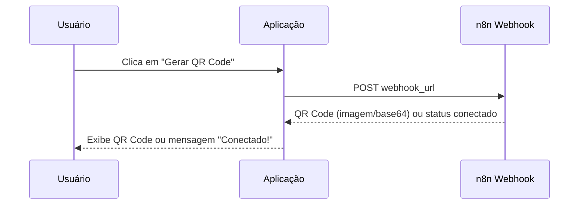

# 📱 Agente IA - QRCode Reconexão WhatsApp

Aplicação web para reconexão do WhatsApp via webhook do n8n, integrada com Chatwoot. Exibe o QR Code de autenticação em uma interface moderna e responsiva.


## ✨ Funcionalidades

- 🔗 **Webhook n8n** — Dispara o webhook e recebe o QR Code automaticamente
- 📷 **Exibição do QR Code** — Suporte a imagem binária e base64 (JSON)
- ✅ **Status de conexão** — Detecta quando o WhatsApp já está conectado
- 🔗 **URL por parâmetro** — Permite passar a URL do webhook via query string
- 💾 **Memória local** — Salva a última URL utilizada no navegador
- 🎨 **Interface moderna** — Design responsivo com tema escuro e animações

## 🚀 Como usar

### Rodando localmente

```bash
# Instalar dependências
pip install -r requirements.txt

# Iniciar a aplicação
python app.py
```

Acesse em: `http://localhost:5000`

### Passando a URL do webhook via parâmetro

```
http://localhost:5000/?url=seu-n8n.com/webhook/seu-id-aqui
```

O `https://` é adicionado automaticamente na URL do webhook.

### Com Docker

```bash
# Build da imagem
docker build -t qrcode-reconect .

# Rodar o container
docker run -d -p 5000:5000 --name qrcode-reconect qrcode-reconect
```

## ☁️ Deploy com Coolify

1. Suba o código para um repositório Git (GitHub, GitLab, etc.)
2. No Coolify, crie um **New Resource → Application**
3. Selecione o repositório e a branch
4. Configure:
   - **Build Pack:** `Dockerfile`
   - **Port:** `5000`
5. Configure o domínio desejado em **Domains**
6. Clique em **Deploy** 🚀

O Coolify cuidará do SSL (HTTPS) automaticamente.

## 📁 Estrutura do Projeto

```
├── app.py              # Servidor Flask (backend)
├── templates/
│   └── index.html      # Interface web (frontend)
├── requirements.txt    # Dependências Python
├── Dockerfile          # Build para produção
├── .dockerignore       # Arquivos ignorados no Docker
└── README.md
```

## ⚙️ Como funciona



1. O usuário informa a URL do webhook do n8n
2. A aplicação dispara um POST para o webhook
3. O n8n processa e retorna o QR Code do WhatsApp (ou indica que já está conectado)
4. A aplicação exibe o resultado na tela

## 🛠 Tecnologias

- **Backend:** Python, Flask, Gunicorn
- **Frontend:** HTML, CSS, JavaScript (vanilla)
- **Deploy:** Docker, Coolify
- **Integração:** n8n, Chatwoot, WhatsApp

---

Desenvolvido com ⚡ por **DataClarus**
